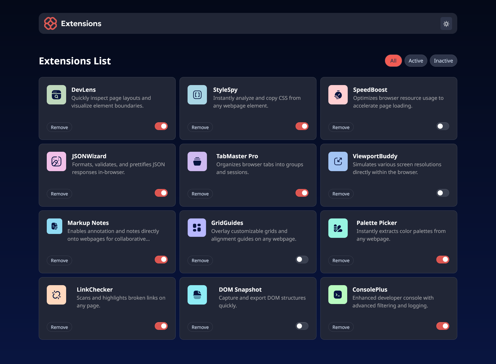
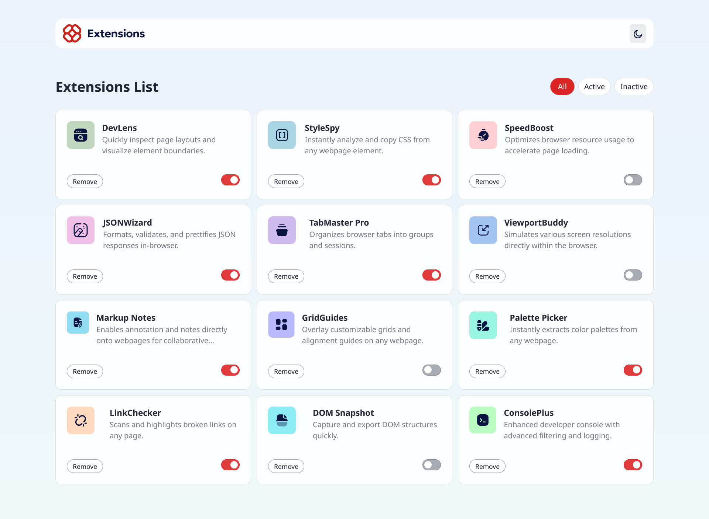
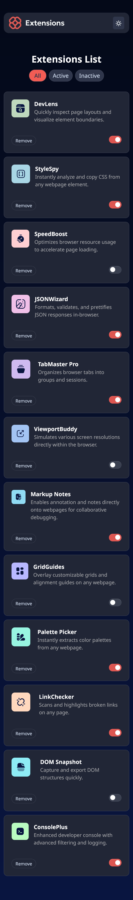
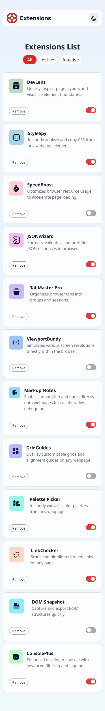

# Frontend Mentor - Browser extensions manager UI solution

This is a solution to the [Browser extensions manager UI challenge on Frontend Mentor](https://www.frontendmentor.io/challenges/browser-extension-manager-ui-yNZnOfsMAp). Frontend Mentor challenges help you improve your coding skills by building realistic projects. 

## Table of contents

- [Overview](#overview)
  - [The challenge](#the-challenge)
  - [Screenshot](#screenshot)
  - [Links](#links)
- [My process](#my-process)
  - [Built with](#built-with)
  - [What I learned](#what-i-learned)
  - [Continued development](#continued-development)
  - [Useful resources](#useful-resources)
- [Author](#author)
- [Acknowledgments](#acknowledgments)

## Overview

### The challenge

Users should be able to:

- Toggle extensions between active and inactive states
- Filter active and inactive extensions using filter buttons
- Remove extensions from the list with proper array index handling
- Switch between light and dark themes with localStorage persistence
- View the optimal layout for the interface depending on their device's screen size
- See hover and focus states for all interactive elements on the page

### Screenshot






### Links

- Solution URL: [GitHub Repository](https://github.com/Mariam-44/Browser-extensions-manager.git)
- Live Site URL: [Live Demo](https://splendorous-piroshki-bb244a.netlify.app/)

## My process

### Built with

- Semantic HTML5 markup
- CSS custom properties
- Tailwind CSS for styling
- DaisyUI components (toggle switches)
- Vanilla JavaScript ES6+
- CSS Grid and Flexbox for layouts
- Mobile-first responsive design
- LocalStorage API for data persistence

### What I learned

This project helped me understand several key concepts:

**1. Proper Array Index Management in Filtered Views**
```js
function displayCards(cards) {
  const content = cards
    .map((card) => {
      const index = allCards.findIndex((c) => c === card);
      return `<div data-index="${index}">...</div>`;
    })
    .join("");
}
```

**2. Smart Data Loading with Fallback**
```js
async function loadData() {
  try {
    let saved = localStorage.getItem("cards");
    if (saved) {
      allCards = JSON.parse(saved);
    } else {
      let res = await fetch("../../data.json");
      allCards = await res.json();
      localStorage.setItem("cards", JSON.stringify(allCards));
    }
    displayCards(allCards);
  } catch (error) {
    console.log("Error loading", error);
  }
}
```

**3. Modular Event Handler Functions**
```js
function deleteCard() {
  document.querySelectorAll(".remove-btn").forEach((btn) => {
    btn.addEventListener("click", () => {
      const index = parseInt(btn.dataset.index);
      allCards.splice(index, 1);
      localStorage.setItem("cards", JSON.stringify(allCards));
      applyFilter(); 
    });
  });
}

function toggleState() {
  document.querySelectorAll(".toggle").forEach((toggle) => {
    toggle.addEventListener("change", () => {
      const index = parseInt(toggle.dataset.index);
      allCards[index].isActive = toggle.checked;
      localStorage.setItem("cards", JSON.stringify(allCards));
    });
  });
}
```

**3. Filter State Management**

**4. Advanced CSS with Tailwind Layers**
```css
@layer base {
  button:focus {
    @apply outline outline-2 outline-neutral-0 ring-[3px] ring-red-400 bg-neutral-300/20 border-0 !important;
  }
  .dark button:focus {
    @apply outline outline-2 outline-neutral-900 ring-[3px] ring-red-400 bg-neutral-600 !important;
  }
  button.active:focus {
    @apply bg-red-600 dark:bg-red-400 !important;
  }
}

@layer components {
  .filter-btn {
    @apply px-3 py-1 text-sm rounded-full border 
           bg-white text-neutral-800 
           dark:bg-neutral-700 dark:text-neutral-200
           dark:border-neutral-600/60 border-neutral-300/60;
  }
  .filter-btn.active {
    @apply bg-red-600 text-neutral-100 font-medium 
           dark:bg-red-400 dark:text-neutral-700 dark:hover:bg-red-500;
  }
}
```

### Continued development

Areas I want to continue focusing on in future projects:

- **Component Architecture**: Breaking down JavaScript functionality into reusable, modular functions
- **Advanced CSS Layers**: Using Tailwind's @layer directive for better CSS organization and specificity control
- **Data Persistence Patterns**: Implementing robust localStorage strategies with fallback mechanisms
- **Responsive Grid Systems**: Mastering CSS Grid with Tailwind for complex responsive layouts
- **State Synchronization**: Keeping UI state in sync with data changes across different views

### Useful resources

- [Tailwind CSS Documentation](https://tailwindcss.com/docs) - Essential for understanding utility classes and customization
- [DaisyUI Components](https://daisyui.com/components/) - Helpful for component styling and customization
- [JavaScript Array Methods](https://developer.mozilla.org/en-US/docs/Web/JavaScript/Reference/Global_Objects/Array) - Critical for data manipulation

## Key Features Implemented

- ✅ **Theme Switching**: Complete light/dark mode with localStorage persistence
- ✅ **Smart Filtering**: Filter extensions by All, Active, and Inactive states
- ✅ **Dynamic CRUD Operations**: remove and toggle extension states
- ✅ **Responsive Grid Layout**: CSS Grid system that adapts from mobile to desktop
- ✅ **Data Persistence**: LocalStorage integration with JSON file fallback
- ✅ **Accessible Focus States**: Custom focus rings and keyboard navigation
- ✅ **Modular JavaScript**: Clean separation of concerns with dedicated functions
- ✅ **Error Handling**: Robust async data loading with try-catch blocks

## Author

- Website - [Frontend Mentor | Browser extensions manager UI](https://splendorous-piroshki-bb244a.netlify.app/)
- Frontend Mentor - [@Mariam-44](https://www.frontendmentor.io/profile/Mariam-44)
- GitHub - [@Mariam-44](https://github.com/Mariam-44)

## Acknowledgments

Thanks to the Frontend Mentor community for feedback and support during the development of this project. Special appreciation for the design team who created this challenging and realistic project scenario.